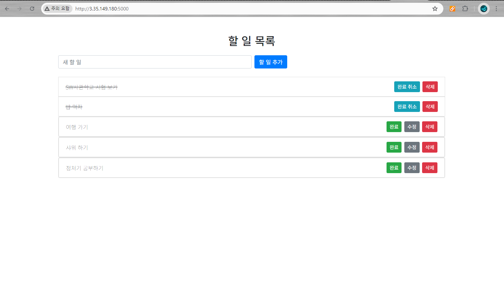

# SW 사관학교 정글(카이스트) 학습자료 기록


> 이렇게 학습했어요 !

### **[목차]**
- Chapter 1 : 프론트엔드 - HTML, CSS
- Chapter 2 : 자바스크립트 - JavaScript, JQuery, Ajax
- Chapter 3 : 파이썬, 데이터베이스 - Python, mongoDB
- Chapter 4 : 백엔드 - Flask
- Chapter 5 : 배포 - AWS

## Getting Started / 어떻게 시작하나요?

### Prerequisites / 선행 조건

아래 사항들이 설치가 되어있어야합니다.

1. Chrome 설치


2. VSC 설치


3. Amazon EC2 가입
- [(회원가입 링크)](https://portal.aws.amazon.com/billing/signup#/start)


4. Gabia 가입
- 회원가입 페이지 : [(회원가입 링크)](https://www.gabia.com/member/member_register.php)


5. MongoDB Atlas

<br/>

---

### Installing / 설치

Python 외부 패키지를 사용하는 경우

requirements.txt 를 참조하여 pip install 합니다

```
pip install -r requirements.txt
```

<br/>

## Deployment / 배포

Amazon EC2 instance

**Public 접속 주소 : http://3.35.149.180:5000/**

> 비용상의 문제로 곧 인스턴스 중지 예정



<br/>

## Built With / 누구랑 만들었나요?

<table>
  <tbody>
    <tr>
      <td align="center"><a href=""><br /><sub><b>SorrowAddict</b></sub></a><br /></td>
    </tr>
  </tbody>
</table>

<br/>

<div align=center><h1>📚 STACKS</h1></div>

<div align=center>  
   
  
  <br>
  
   
   
   
  
  <br>

   
   
  
  <br>
  
  
  
  <br>
</div>

## Contributiong / 기여

Please read [CONTRIBUTING.md](https://gist.github.com/PurpleBooth/b24679402957c63ec426) for details on our code of conduct, and the process for submitting pull requests to us. / [CONTRIBUTING.md](https://gist.github.com/PurpleBooth/b24679402957c63ec426) 를 읽고 이에 맞추어 pull request 를 해주세요.

## License / 라이센스

This project is licensed under the MIT License - see the [LICENSE.md](https://gist.github.com/PurpleBooth/LICENSE.md) file for details / 이 프로젝트는 MIT 라이센스로 라이센스가 부여되어 있습니다. 자세한 내용은 LICENSE.md 파일을 참고하세요.

## Acknowledgments / 감사의 말

* Hat tip to anyone whose code was used / 코드를 사용한 모든 사용자들에게 팁
* Inspiration / 영감
* etc / 기타